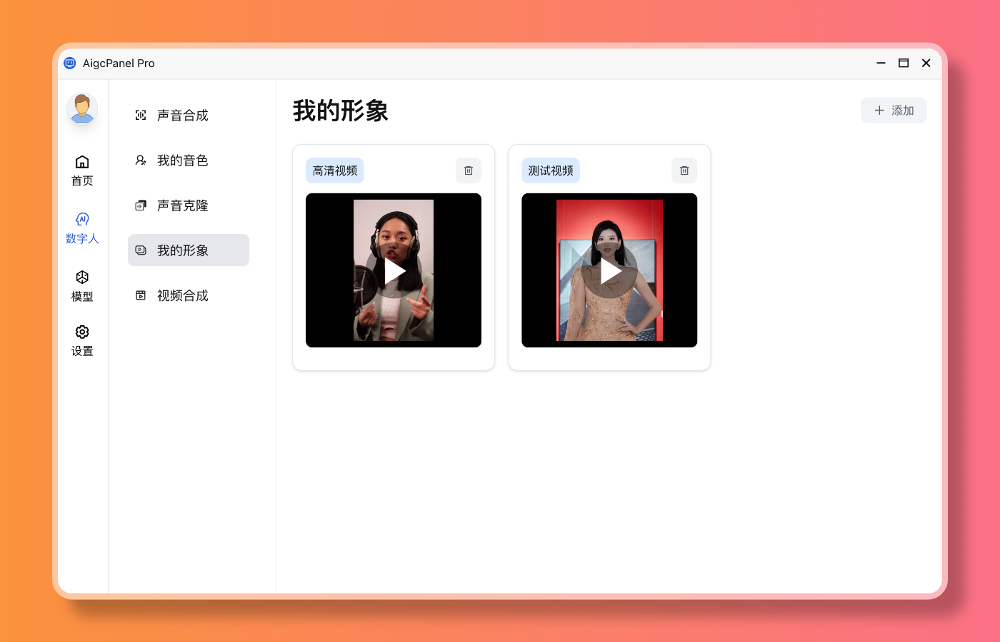
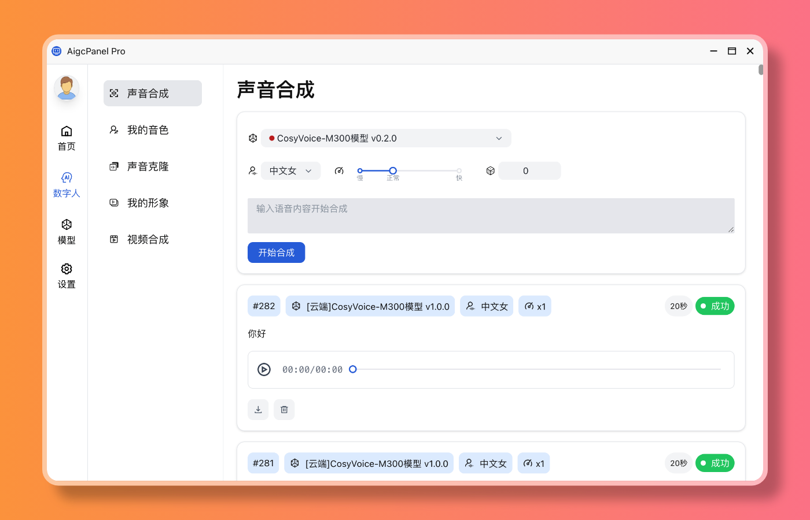
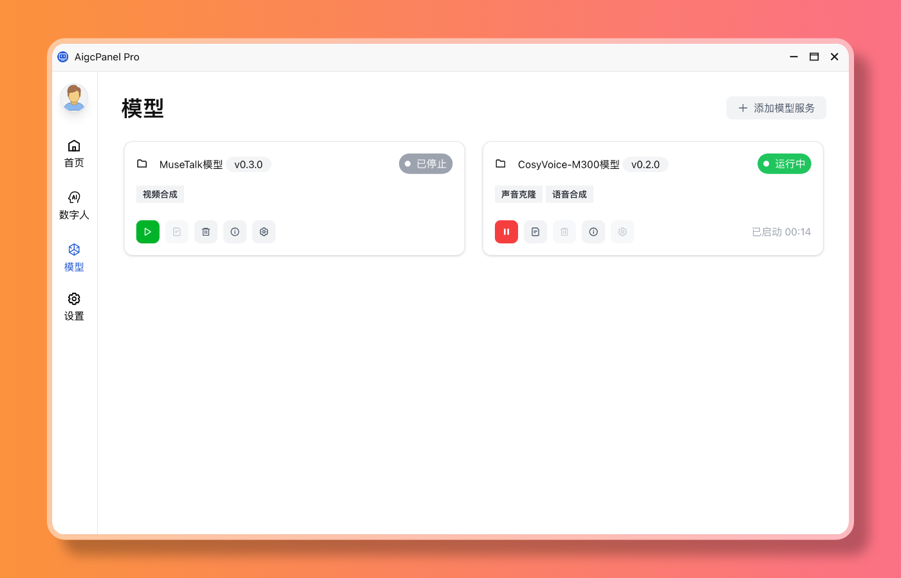

# AigcPanel


[](https://aigcpanel.com)
[](https://github.com/modstart-lib/aigcpanel)
[](https://gitee.com/modstart-lib/aigcpanel)
[](https://gitcode.com/modstart-lib/aigcpanel)

## 软件介绍

`AigcPanel` 是一个简单易用的一站式AI数字人系统，小白也可使用。
支持视频合成、声音合成、声音克隆，简化本地模型管理、一键导入和使用AI模型。

> 禁止使用本产品进行违法违规业务，使用本软件请遵守中华人民共和国法律法规。

## 功能特性

- 支持视频数字人合成，支持视频画面和声音换口型匹配
- 支持语音合成、语音克隆，多种声音参数可设置
- 支持多模型导入、一键启动、模型设置、模型日志查看
- 支持国际化，支持简体中文、英语
- 支持多种模型一键启动包
  - 声音模型 `CosyVoice-300M`
  - 声音模型 `CosyVoice-300M-Instruct`
  - 声音模型 `CosyVoice2-0.5b`
  - 声音模型 `FishSpeech`
  - 声音模型 `SparkTTS`
  - 视频模型 `MuseTalk`
  - 视频模型 `LatentSync`
  - 视频模型 `Wav2Lip`

## 效果预览

参考 [demo](demo/) 中的视频文件。

## 功能预览

### 视频合成


### 我的形象



### 语音克隆


### 语音合成



### 模型管理



## 安装使用

### Windows

- 访问 [https://aigcpanel.com](https://aigcpanel.com) 下载 Windows 安装包，一键安装即可

安装完成后，打开软件，下载模型一键启动包，即可使用。

## 模型自定义接入

一个模型即是一个文件夹，至少包含 config.json 和 server.js 两个文件。

```
|- 模型文件夹/
|-|- config.json - 模型配置文件
|-|- server.js   - 模型对接文件
|-|- xxx       - 其他模型文件，推荐将模型文件放在 model 文件夹下
```

### 简易接入

> 需要掌握 python 开发能力

首先需要将python环境打包到同一个目录，比如 `_aienv` ，然后可以通过 `python run.py ./config.json` 的方式运行模型。

模型运行之后，通过标准输入输出的方式运行模型，通过标准输入传递参数，通过标准输出返回结果。

```python
# 输出格式为 AigcPanelRunResult[id][base64(json(data))]
import json, base64

# 解析输入配置文件
config = json.loads(open(sys.argv[1], 'r').read())
modelConfig = config['modelConfig']

def printResult(key,value):
    global config
    print(f'AigcPanelRunResult[{config['id']}][' + base64.b64encode(json.dumps({key: value}).encode()).decode()+']')

# 公共输出
## 输出给前端的是否是以 CUDA 运行
printResult('UseCuda', True)

## 语音合成输出结果
printResult('url', '/path/to/result.wav')

## 语音克隆输出结果
printResult('url', '/path/to/result.wav')

## 视频对口型输出结果
printResult('url', '/path/to/result.mp4')
```

#### config.json 文件示例


```json5
{
    "name": "server-xxx",          // 模型名称
    "version": "0.1.0",            // 模型版本
    "title": "语音模型",            // 模型标题
    "description": "模型描述",      // 模型描述
    "deviceDescription":"设备描述",
    "platformName": "win",         // 支持系统，win, osx, linux
    "platformArch": "x86",         // 支持架构，x86, arm64
    "serverRequire": ">=0.5.0",    // 对 AigcPanel 版本的要求，如 >=0.5.0
    "entry": "__EasyServer__",     // 固定值，不需要修改
    "easyServer": {
        // python 运行入口
        "entry": "./_aienv/bin/python",
        "entryArgs": [
            "run.py",
            "${CONFIG}"
        ],
        // 环境变量
        "envs": [
            "AAA=1"
        ]
    },
    "functions": [
        "videoGen",                // 支持视频生成
        "soundTTS",                // 支持语音合成
        "soundClone"               // 支持语音克隆
    ],
    "settings": [                  // 模型配置项，可以显示在模型配置页面
        {
            "name": "port",
            "type": "text",
            "title": "服务端口",
            "default": "",
            "placeholder": "留空会检测使用随机端口"
        }
    ]
}
```

#### 测试导入

完成两个文件的开发之后，在软件中尝试选择模型文件夹中的config.json导入。

### 高级接入

> 需要掌握 js 开发能力

#### config.json 文件示例

```json5
{
    "name": "server-xxx",          // 模型名称
    "version": "0.1.0",            // 模型版本
    "title": "语音模型",            // 模型标题
    "description": "模型描述",      // 模型描述
    "deviceDescription":"设备描述",
    "platformName": "win",         // 支持系统，win, osx, linux
    "platformArch": "x86",         // 支持架构，x86, arm64
    "serverRequire": ">=0.5.0",    // 对AigcPanel版本的要求，如 >=0.5.0
    "entry": "main.exe",           // 入口文件
    "functions": [
        "videoGen",                // 支持视频生成
        "soundTTS",                // 支持语音合成
        "soundClone"               // 支持语音克隆
    ],
    "settings": [                  // 模型配置项，可以显示在模型配置页面
        {
            "name": "port",
            "type": "text",
            "title": "服务端口",
            "default": "",
            "placeholder": "留空会检测使用随机端口"
        }
    ]
}
```

#### server.js 文件示例

```js
const serverRuntime = {
    port: 0,
}

let shellController = null
let isRunning = false

module.exports = {
    ServerApi: null,
    ServerInfo: null,
    url() {
        return `http://localhost:${serverRuntime.port}/`
    },
    // 模型启动
    async start() {
        // 发送一个启动中的消息
        this.send('starting', this.ServerInfo)
        // 获取一个可用端口，如果用户设置了端口，则使用用户设置的端口
        if (this.ServerInfo.setting && this.ServerInfo.setting.port) {
            serverRuntime.port = this.ServerInfo.setting.port
        } else if (!serverRuntime.port || !await this.ServerApi.app.isPortAvailable(serverRuntime.port)) {
            serverRuntime.port = await this.ServerApi.app.availablePort(50617)
        }
        // 模型启动命令，这里假设需要运行的命令是 python main.py
        let command = []
        command.push(`"${this.ServerInfo.localPath}/_aienv/python.exe"`)
        command.push(`main.py`)
        // 环境变量，这里需要定义一下环境变量，比如python路径，二进制文件路径等，以下环境变量是绝大多数环境需要添加的
        const envMap = {}
        const dep = process.platform === 'win32' ? ';' : ':'
        envMap['PATH'] = process.env['PATH'] || ''
        envMap['PATH'] = `${this.ServerInfo.localPath}{dep}${envMap['PATH']}`
        envMap['PYTHONIOENCODING'] = 'utf-8'
        // 这里开始启动命令，启动命令会返回一个控制器，可以用来停止命令
        shellController = await this.ServerApi.app.spawnShell(command, {
            stdout: (data) => {
                this.sendLog(data)
            },
            stderr: (data) => {
                this.sendLog(data)
            },
            success: (data) => {
                this.send('success', this.ServerInfo)
            },
            error: (data, code) => {
                this.sendLog(data)
                this.send('error', this.ServerInfo)
            },
            env: envMap,
            cwd: this.ServerInfo.localPath,
        })
    },
    // 模型测试是否可用
    async ping() {
        try {
            // 这里假设模型的ping接口是 /ping ，正确返回 ping，错误返回 false
            const res = await this.ServerApi.request(`${this.url()}ping`)
            return true
        } catch (e) {
            return false
        }
    },
    // 模型停止
    async stop() {
        this.send('stopping', this.ServerInfo)
        try {
            shellController.stop()
            shellController = null
        } catch (e) {
            console.log('stop error', e)
        }
        this.send('stopped', this.ServerInfo)
    },
    // 获取模型配置信息
    async config() {
        return {
            code: 0,
            msg: "ok",
            data: {
                // 模型的地址信息
                httpUrl: shellController ? this.url() : null,
                // 模型说明信息
                content: '模型说明',
                functions: {
                    // 声音合成
                    soundTts: {
                        param:[]
                    },
                    // 声音克隆
                    soundClone: {
                        param: []
                    },
                    // 视频对口型
                    videoGen: {
                        param: []
                    }
                }
            }
        }
    },
    // 执行调用：视频对口型
    async videoGen(data) {
        // data = { id: '任务ID', videoFile: '视频文件路径', soundFile: '声音文件路径' }
        const resultData = {
            // success, querying, retry
            type: 'success', 
            start: 0, 
            end: 0, 
            data: {
                filePath: null
            }
        }
        if (isRunning) {
            resultData.type = 'retry'
            return { code: 0, msg: 'ok', data: resultData }
        }
        isRunning = true
        const param = data.param || {}
        resultData.start = Date.now()
        try {
            this.send('taskRunning', {id: data.id})
            // 模型调用请求，完成调用逻辑
            // 视频文件路径 data.videoFile
            // 声音文件路径 data.soundFile
            resultData.data.filePath = '合成之后的本地mp4路径'
            resultData.end = result.endTime
            return { code: 0, msg: 'ok', data: resultData }
        } catch (e) {
            throw e
        } finally {
            isRunning = false
        }
    },
    // 执行调用：声音合成
    async soundTts(data) {
        // data = { id: '任务ID', text: '合成文本' }
        const resultData = {
            // success, querying, retry
            type: 'success',
            start: 0,
            end: 0,
            data: {
                filePath: null
            }
        }
        if (isRunning) {
            resultData.type = 'retry'
            return { code: 0, msg: 'ok', data: resultData }
        }
        isRunning = true
        const param = data.param || {}
        resultData.start = Date.now()
        try {
            this.send('taskRunning', {id: data.id})
            // 模型调用请求，完成调用逻辑
            // 合成文本 data.text
            resultData.data.filePath = '合成之后的本地wav路径'
            resultData.end = result.endTime
            return { code: 0, msg: 'ok', data: resultData }
        } catch (e) {
            throw e
        } finally {
            isRunning = false
        }
    },
    // 执行调用：声音克隆
    async soundClone(data) {
        // data = { id: '任务ID', text: '合成文本', promptAudio: '参考音频路径', promptText: '参考音频文字' }
        const resultData = {
            // success, querying, retry
            type: 'success',
            start: 0,
            end: 0,
            data: {
                filePath: null
            }
        }
        if (isRunning) {
            resultData.type = 'retry'
            return { code: 0, msg: 'ok', data: resultData }
        }
        isRunning = true
        const param = data.param || {}
        resultData.start = Date.now()
        try {
            this.send('taskRunning', {id: data.id})
            // 模型调用请求，完成调用逻辑
            // 合成文本 data.text
            resultData.data.filePath = '合成之后的本地wav路径'
            resultData.end = result.endTime
            return { code: 0, msg: 'ok', data: resultData }
        } catch (e) {
            throw e
        } finally {
            isRunning = false
        }
    },
}
```

#### 测试导入

完成两个文件的开发之后，在软件中尝试选择模型文件夹中的config.json导入。

## 技术栈

- `electron`
- `vue3`
- `typescript`

## 本地运行开发

> 仅在 node 20 测试过

```shell
# 安装依赖
npm install
# 调试运行
npm run dev
# 打包
npm run build
```

## 加入交流群

> 添加好友请备注 AigcPanel

<table width="100%">
    <thead>
        <tr>
            <th width="50%">微信交流群</th>
            <th>QQ交流群</th>
        </tr>
    </thead>
    <tbody>
        <tr>
            <td>
                
            </td>
            <td>
                
            </td>
        </tr>
    </tbody>
</table>

## License

Apache-2.0
